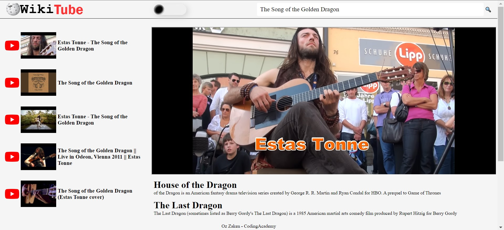
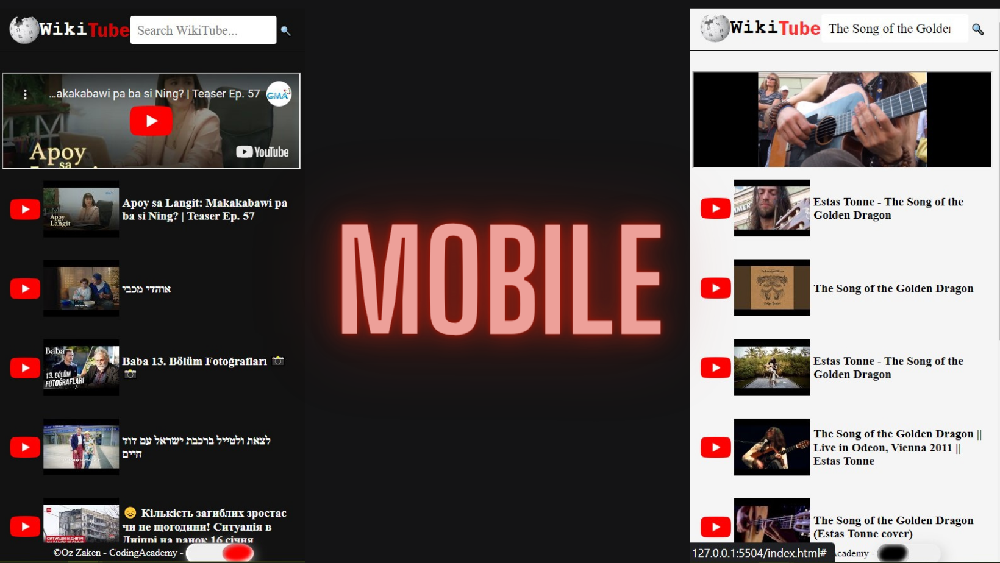

#  Welcome to  WikiTube 
Wikipedia &amp; YouTube combination 

WikiTube is a web application that merges the functionality of YouTube and Wikipedia. It allows users to search for videos on YouTube and also displays related Wikipedia articles on the same page. This creates an all-in-one experience for users to learn and explore topics they are interested in.
[Check it Out](https://ozzaken.github.io/WikiTube/)

## Features
- Search for YouTube videos
- Display related Wikipedia articles
- Responsive design for different screen sizes
- Light/dark theme toggle
   

## Technologies Used
- HTML
- CSS
- JavaScript
- YouTube API
- Wikipedia API

## How it works
The website uses CSS and JavaScript to create a dynamic user interface. The CSS code is divided into different sections such as setup, basic, components, and view. The JavaScript code uses a service called "wtService" which handles the communication between the website and the YouTube and Wikipedia APIs.

The website also includes a feature to toggle between light and dark themes by clicking on a button in the footer. Additionally, the website is designed to be responsive, adjusting its layout for different screen sizes using media queries.

## Conclusion
WikiTube is a unique and useful web application that allows users to explore and learn about different topics in a convenient way. With its combination of YouTube and Wikipedia, it provides a one-stop destination for users to search and learn about their interests.